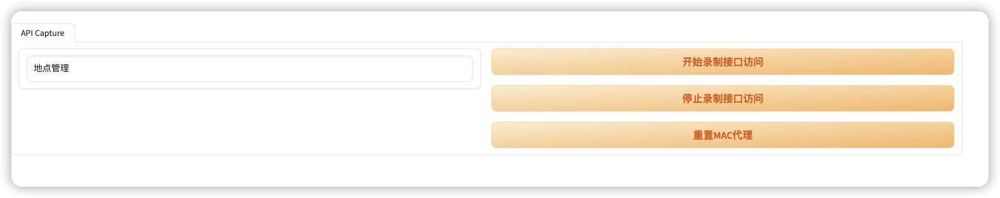
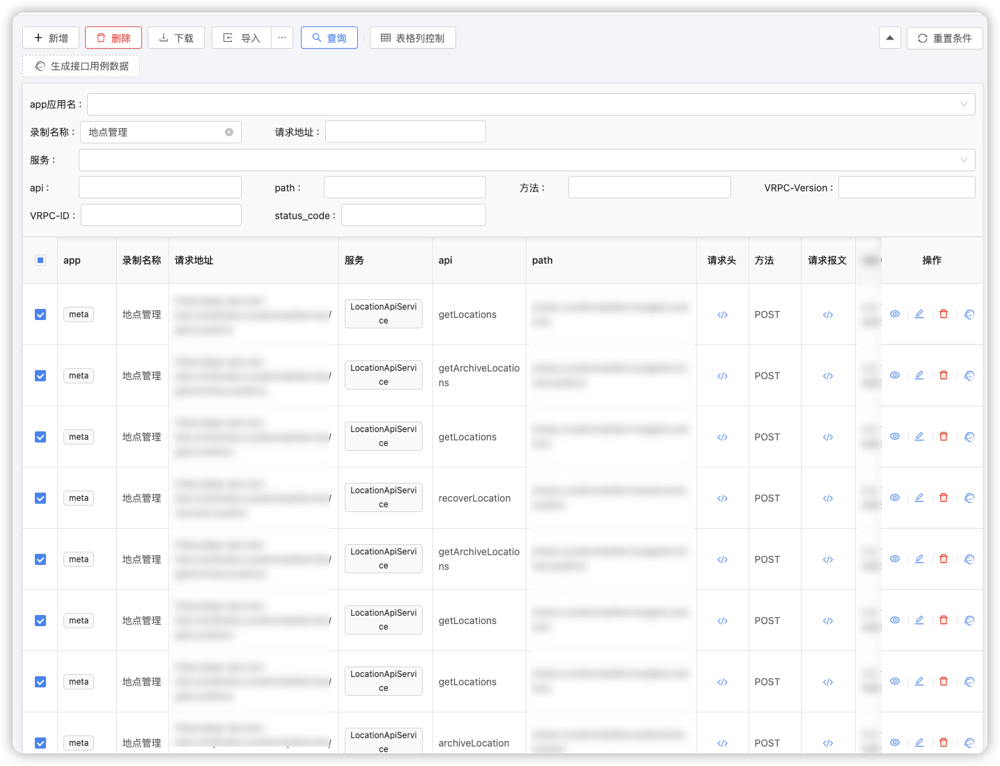
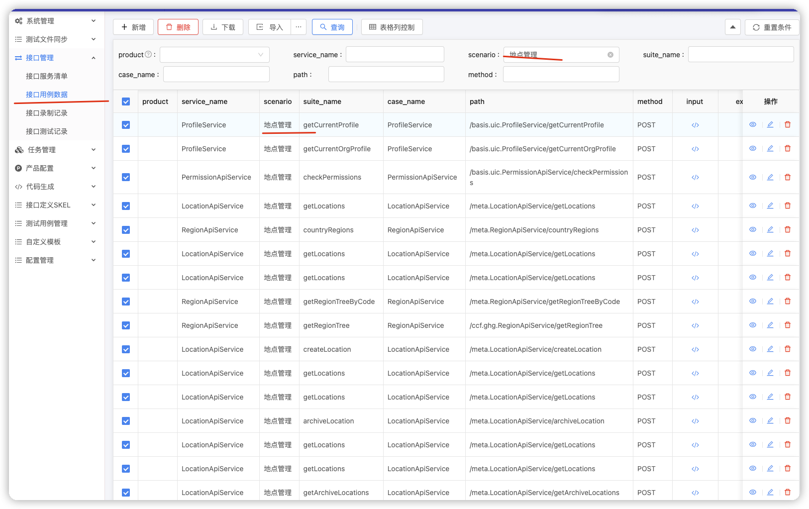
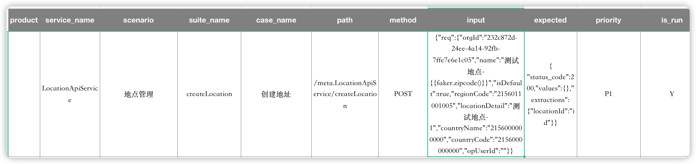
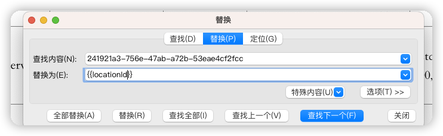
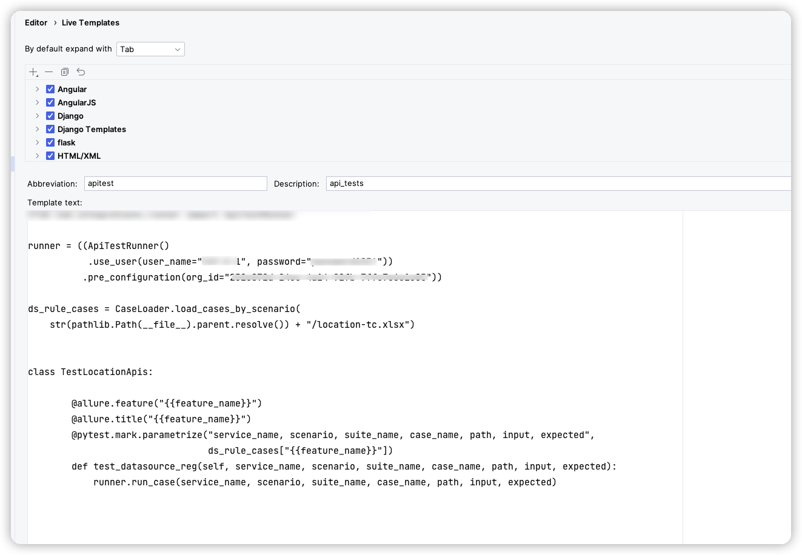
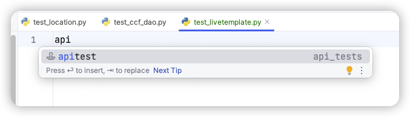

# 极简接口回归测试之录制回放模式

> 我们都是草台班子,有时只是想让自己日子好过一些;纸上得来终觉浅,不如自己动手试

接口一次一次的重构,所以需要一次一次的回归。
接口数量慢慢越加越多了,回归头越来越大了。 怎么办？也看过不少大佬们的各种接口工具,但是从头搞总是花时间,有简单点的办法吗?
看了再多的文章不能解决自己问题,也就意义不大;虽然丑陋和草根,如果能有点用,也是点小收获.

不想再加大量增加工作量做接口自动化了，怎么办？刚好之前做过两个极简:
- [极简接口录制](https://testerhome.com/topics/36369)
- [极简接口录制的后台数据管理](https://testerhome.com/articles/36400)

于是就想，这样吧,如果平时在做功能测试的时候进行常用场景的录制,然后这些常用场景录制的接口进行回归测试怎么样？但是录制下来的这些脚本可以重复跑吗？如果不能重复跑，每次都录制一下不是测试都做完了吗,不是多此一举吗？ 冷静冷静 ......

接口最常用的功能是***增删改查***，所以回归的时候，对一个资源进行
- 创建
- 更改
- 删除/失效
- 查询

如果在一定固定的测试数据情况下, 回归测试录制的脚本是可以重复使用的，当然有些条件需要满足.
好在满足条件在不少场景下，就是一个新创建出来的id, 那好想是可以完成的哇. 

行动，行动！多想没好处，动手才行。分三步走:
1. Record: 迭代测试回归的时候，录制场景
2. Compose: 修改录制出来的数据，变成反复执行的测试用例
3. Run: 运行可以查看测试结果，也可以检查是否覆盖了所有的API

## Record:迭代测试回归的时候，录制场景

使用下面提到的工具:

- [极简接口录制](https://testerhome.com/topics/36369)
- [极简接口录制的后台数据管理](https://testerhome.com/articles/36400)

进行录制步骤: 

- 1.开始在迭代测试中进行录制


- 2.后台记录数据,挑选需要的接口选择生成测试用例数据

- 3.进入后台测试用例数据,生成测试用例EXCEL下载


## Compose：修改录制出来的数据，变成反复执行的测试用例

Compose, 对的，你就是那个作曲家，只不过有点苦，看的都是无聊的数据,下面是导出的EXCEL数据:

- 下载EXCEL测试数据例子


- 修改会因为重复检查报错的数据，比如名称:

```shell
    {"name":"测试地点-{{faker.zipcode()}}}
```
用{{faker.zipcode()}}作为随机数,这个随机数也没什么密码,看下jinja2模版就行 
- 让新建的id可以记录在运行时中,被后面接口调用时使用

```json
{ "status_code":200,"values":{}
,"extractions": {"locationId","id"}}
```
在现在的expected里面,加入
```"extractions": {"locationId","id"}}```,代表接口返回的字段id的值，会给运行时的locationId字段

- 替换原来录制时候的id



- 编写python代码

使用pycharm livetemplate做一些模版



新建测试python文件,输入apitest,tab键，自动补齐，进行代码微调



## Run: pytest/allure运行测试代码

代码，数据调整好之后，就可以运行测试代码了.测试结果也不会生成报告并且在后台会有记录.

```sh
poetry run pytest $1 --alluredir=tests-results
```

## 小结

一个上午自己尝试了一下,以后起完成两个小模块的接口回归测试录制,大概耗时1个小时不到，包含了15个API,并且目前这些录制的接口
可以重复跑,不用进行任何修改. 所以结论:
1. 这种录制回放模式潜入在回归测试中,有一定可行性
   A. 没有大量增加工作量
   B. 任务可以分解: 业务回归录制和编写数据和代码的人可以分开,如果让手头没有事情的可以进行帮忙处理啊;
   C. 套路比较固定,还可以起到Review测试用例的作用或者录入测试用例作用
2. 在现有的一些工具上构建成本低,如果不适用，不用也不可惜
3. 有一些改造和代码能力,确实可以提高效率
4. 这个实验还算成功,最少马上就能用上了

以上时草台班子测试的一个小实验，如果感兴趣想了解更多细节，可以留言.
