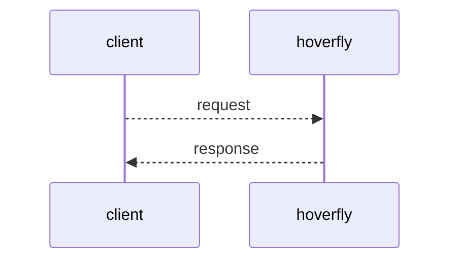
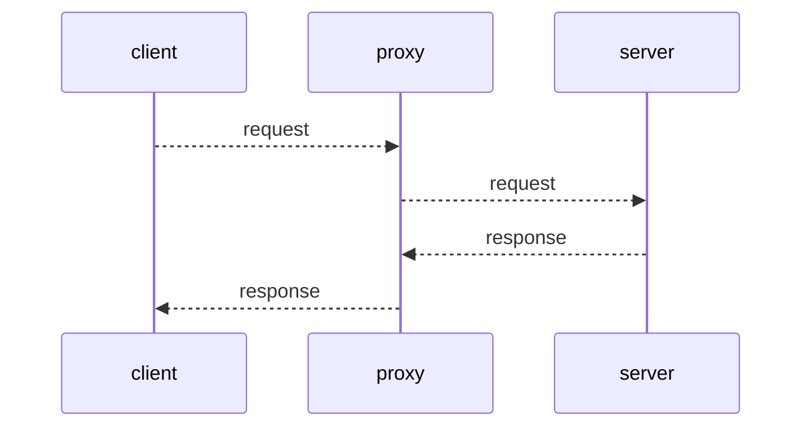
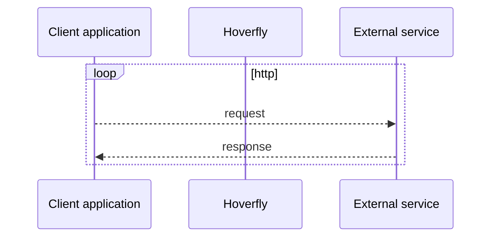
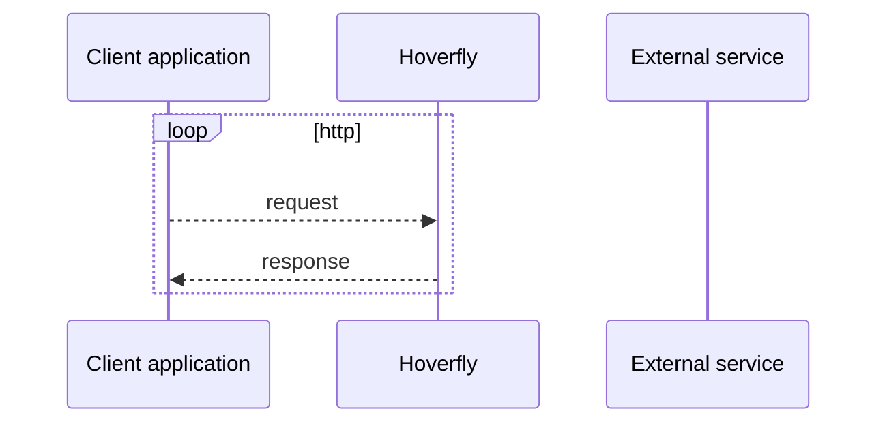
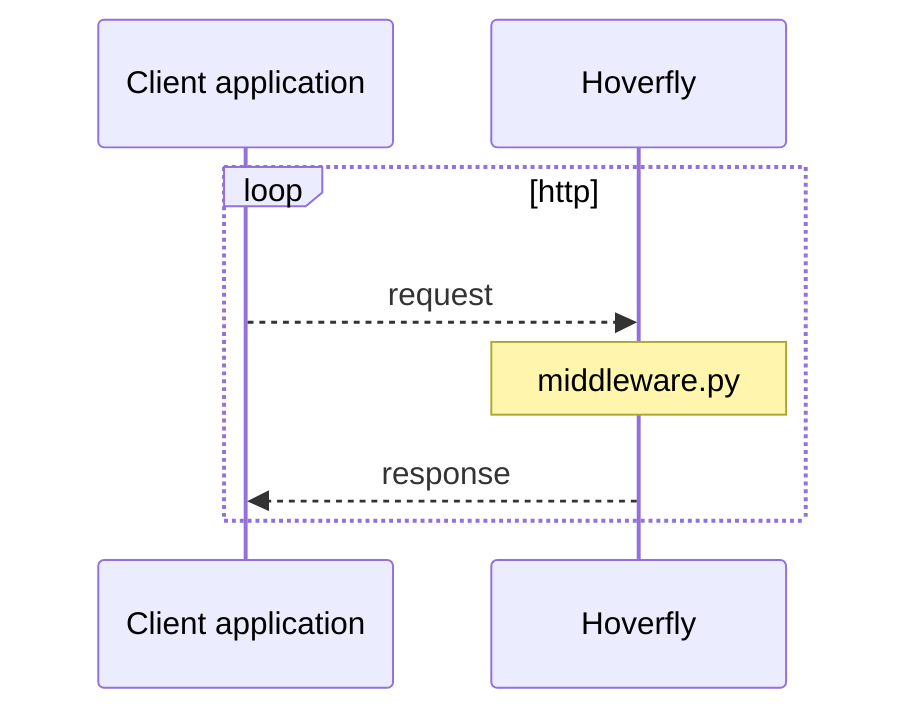
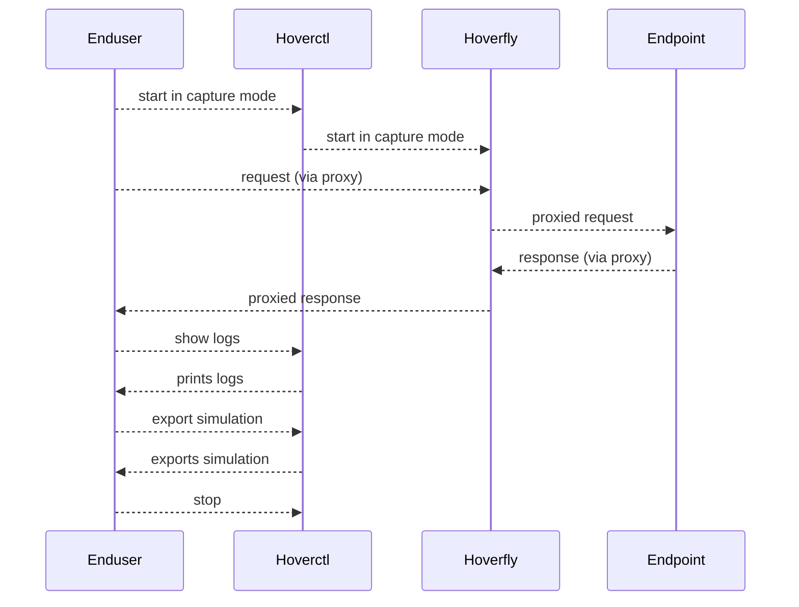

# Hoverfly 一款Mock/虚拟化服务工具

[Hoverfly]( https://github.com/SpectoLabs/hoverfly.git):
> Hoverfly的设计目的是为您提供创建自己的“依赖项沙盒”的手段：一个模拟的开发和测试环境，您可以对其进行控制。

至于说怎么用比较好,好不好用，这些只能自己体会, 每个人体会会不同.

## installation

```sh
docker run -d -p 8888:8888 -p 8500:8500 spectolabs/hoverfly:latest
```

## 使用
WebServer：用来模拟WebSesrver

访问: http://echo.jsontest.com/key/value
可以替代为: http://localhost:8500/key/value


## hoverfly 模式

```
Capture mode: 录制
Simulate mode： 模拟请求返回模式
Spy mode：匹配模拟模式
Synthesize mode：模拟返回使用用户设置脚本
Modify mode： 修改请求和返回
Diff mode：模拟和比较返回值
```

如果通过hoverfly的这种方式看基本上满足了日常可能的API测试时候需要用到的模拟和测试场景.

- 录制模式: 录制API方便后续使用
- 模拟模式: 模拟一些场景进行MOCK
- Simulate/Synthesize场景实际上是模拟模式的增强
- Modify和Diff也是模拟模式的增强
  
我们经常说的所谓MOCK平台，其实上功能都可以在hoverfly看到影子. 

MOCK平台如果要好用,个人观点是需要:
1. 满足个人客户端测试需求，直接拦截客户端请求
2. 可以内部Service之间模拟
3. MOCK数据可以客户段和服务段，团队之间可以共享

所以客户端和服务端都需要，服务端最好是和API gateway，配置中心集成，可以方便的更改节点的路由和配置, 当然可以任意部署节点和更改路由规则会更好，因为这样实际上从客户端开始一种整个链路的路由都可以控制了.

## 不同的模式的介绍

- WebServer


- ProxyServer




- 录制模式：



- 模拟模式:



- 模拟模式: 定制插件






## 主要功能

基本功能:
``` 
创建和导出模拟
导入和使用模拟
向模拟添加延迟
将延迟应用于所有响应
将延迟应用于特定响应
根据主机应用不同的延迟
根据URI应用不同的延迟
根据HTTP方法应用不同的延迟
使用对数正态分布的延迟
使用请求匹配器进行松散请求匹配
使用中间件模拟网络延迟
使用中间件修改响应有效负载和状态码
模拟HTTPS API
将Hoverfly作为Web服务器运行
在Hoverfly上启用CORS支持
捕获或模拟特定URL
捕获有状态的响应序列

```

高级功能:

```shell
SSL 支持
远程Hoverfly Proxy 控制
```

## 总结

个人意见：

1. 功能: 4分 
   * 功能比较丰富满足日常使用
2. 易用: 3.5分
    * 命令行操作，UI比较简陋，对于测试人员来说使用有难度，并且文档都是英文，同样也有一定门槛
3. 代码设计和扩展性: 4.2分，
    * 代码还是比较干净，同时有HOOK和插件机制，代码层面有不少值得学习的内容
4. 实用性: 3.5分
    * 由于语言-英文文档，命令行，UI简单，功能丰富，这些综合Hoverfly实用意义可能不是很大，主要是对于业务MOCK场景其实可能不是巨大需求.

代码可以多多阅读，但是产品化会比较苦难安

## 参考文档:

- [docs](https://docs.hoverfly.io/en/latest/index.html)