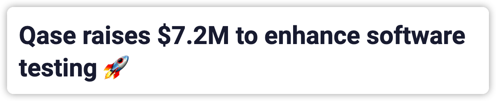
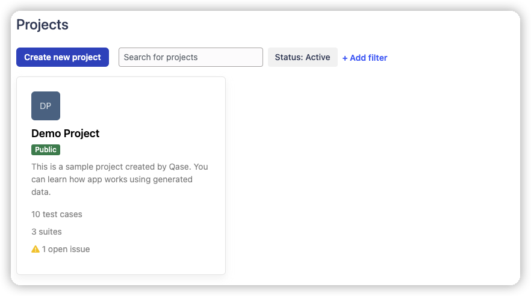

# QASE Intro

> Qase is the first platform in the market with an AI-powered automated test generator based on manual test cases. Customers report that after switching to Qase, testing operation speed increases by up to 60%.

> Testing pipelines have become too complex. At Qase, we want to help QA teams not only facilitate quality gates, but also interpret, aggregate, and collect testing results in one workspace so they can make informed quality decisions. We're going to forge a new market segment in the software testing industry for testing operations (TestOps). Qase integrates with Asana, Github, Jira, Trello, and other tools, and with our future marketplace, we’ll be able to address every need that QA teams have.

Qase Raised $7.2M to develop the test management system. 
It is good to learn it.

## QASE Overview

From my point view, it is a workplace to integrate different activities or application in software development lifecycle in one place. 

Overall:
1. 

QASE, the plugins: 

## QASE Basic Modules

- project

- Test Management
  - Test Cases Repo: Suite/TestCases
  - Test Case Review
  - Test Plan:
    - selected Test cases
    - Test Run Status
  - Test Run
    - Selected Cases
    - Selected Test Plan
    - Defect Integration
    - Team Status
  - Issue Tracking
    - Defects
    - Requirements
    - Milestones

