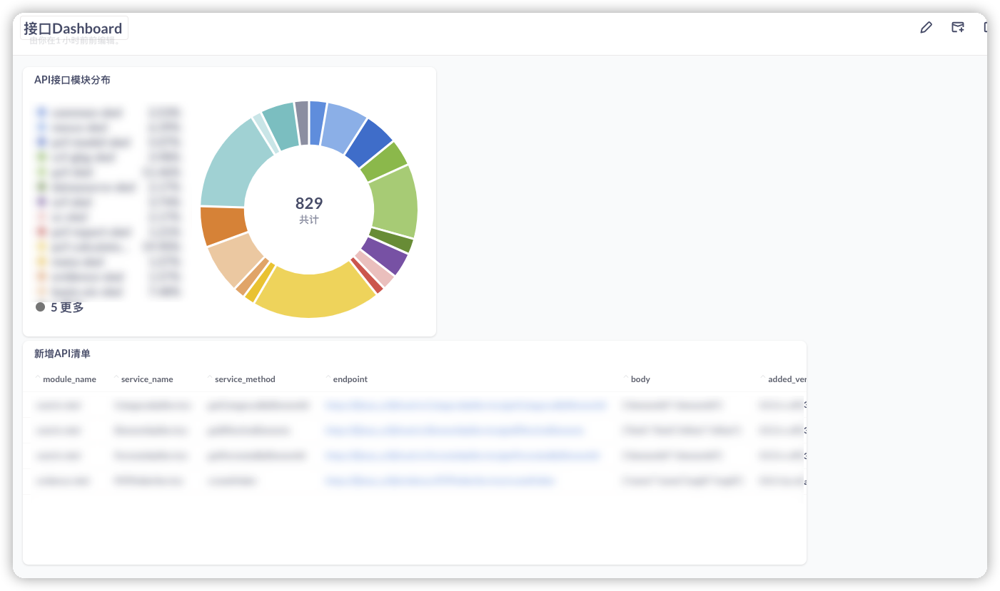

# Metabase for QA

> Fast analytics with the friendly UX and integrated tooling to let your company explore data on their own.

Metabase是一个非常方便实用的可视化统计工具.
测试过程中有一些现实的需求:
1. 新增API有哪些
2. API的在不同模块的分布有哪些
3. API的是否有CASE覆盖了
4. .........

如果自己用写代码，做管理页面对于我们团队来水成本太大.所以采用了METABASE的方式进行处理.

## 1. METABASE 如何构建Dashboard

METABASE 如何构建Dashboard? 分步骤的话:
1. 创建SQL QUERY
2. 可视化配置
3. 加入到DASHBOARD中
4. 将DASHBOARD集成到现有系统中

### 1.1 METABASE创建SQL QUERY

1. 创建SQL QUERY

2. 运行QUERY

第一个新增API的QUERY完成，保存之后提示是否加入Dashboard，加入到Dashboard就可以

### 1.2 METABASE创建饼图

重复创建SQL的方式，只不过这次需要用group by这样的SQL来统计:

同样把这个SQL QUERY 保存就可以，并且加入到Dashboard中。

### 1.3 METABASE Dashboard

通过上面两个步骤，dashboard就已经创建好了.

### 1.4 将DASHBOARD集成到现有系统

1. 配置菜单，加入dashboard  URL就可以

2. 页面就可以有展示dashboard了
