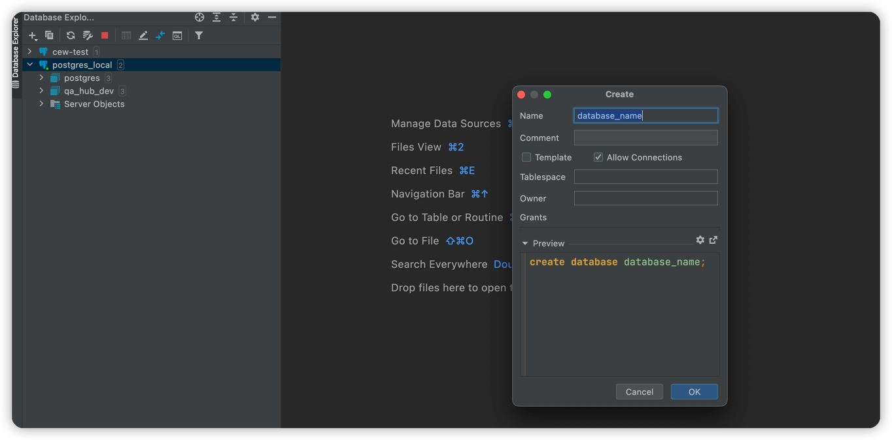
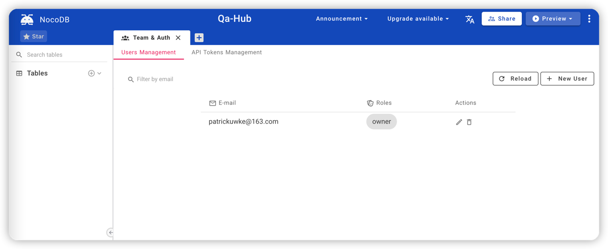

# nocodb Usage

## nocodb setup

1. create project
2. create database 
3. run the application
4. check database table
5. use api
6. use different views
7. application for github

## create project

```shell

```

## create database

1. run docker for postgresql
2. create database


---

## Run the project

```shell
npm run start
```


## create different project





## nocodb 

1. 解决了什么问题？
后端API的构建可以通过图形界面完成
2. 所有的操作通过api接口操作
3. 前端页面需要自己处理
4. 操作还是非常复杂,对于能够写代码的人来说，不如代码生成来的方便
5. 前端页面无法生成是一个硬伤
6. 后台表结构设计可以值得参考
7. 目前整个项目不是很看好
8. 如果通过一个表单设计，直接完成到一个页面或者一个小系统的完成有待提高
9. 需要一个iframe的集成系统可能会比较方便